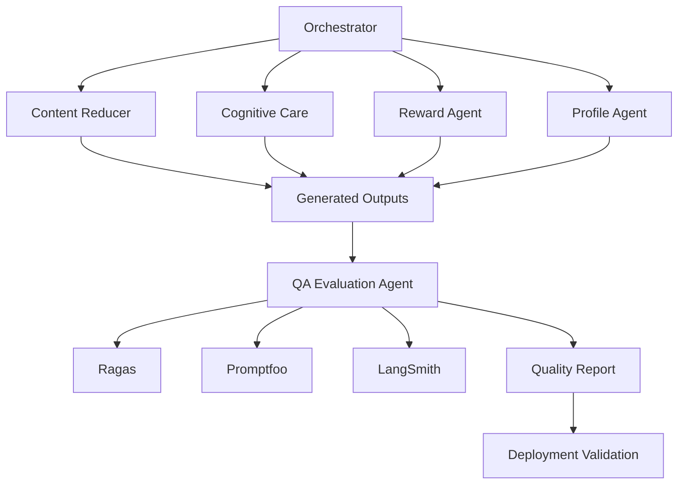
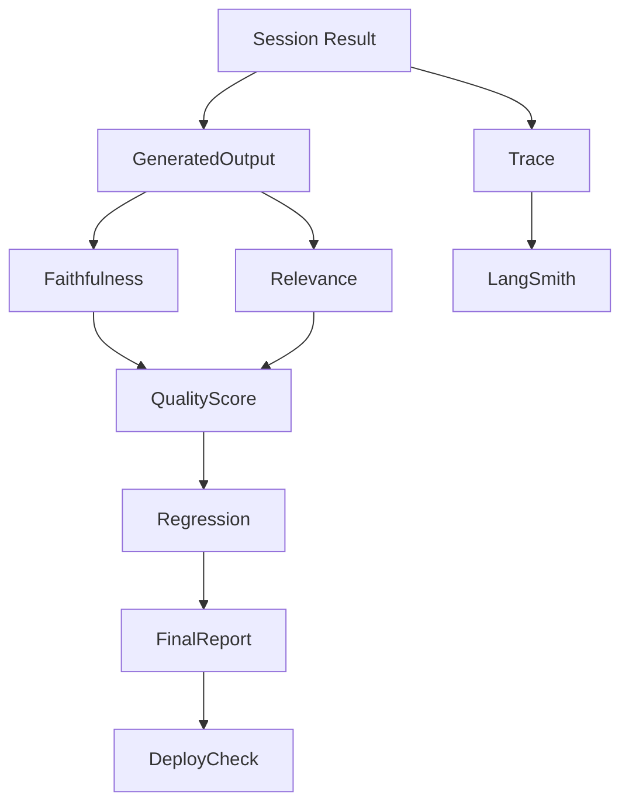

# 1. 시스템 개요 (System Overview)

## 프로젝트명

AI 리터러시 케어 에이전트

## 한 줄 정의

생성 결과의 품질과 시스템 동작을 지속적으로 검증하여 안정적인 문해력 성장 서비스를 보장하는 QA 및 Evaluation 시스템.

## 서비스 목적

사용자가 글을 읽는 과정에서 생성되는 결과들이

* 원문에 충실한지(Faithfulness)
* 문맥과 관련 있는지(Relevance)
* 코드 수정 후 성능이 저하되지 않았는지(Regression)
* 시스템이 안정적으로 동작하는지(Integration)
* 시연 환경이 재현 가능한지(Deployment)

를 지속적으로 검증한다.

---

## 5번 역할의 핵심 목표

5번 역할은 아래 질문에 답할 수 있는 품질 검증 시스템을 만든다.

* 생성 결과가 원문에 충실한가?
* 퀴즈가 글 내용과 관련 있는가?
* 코드 수정 후 기존 성능이 유지되는가?
* 에이전트 호출 흐름을 추적할 수 있는가?
* 시스템 전체가 정상적으로 동작하는가?
* 시연 환경이 항상 재현 가능한가?
* 배포 전에 오류를 발견할 수 있는가?

---

# 2. 기술 스택 및 선정 이유

| Layer             | Tech           | 선정 이유                      | 5번 역할의 책임 |
| ----------------- | -------------- | -------------------------- | --------- |
| Unit Test         | pytest         | 함수 단위 검증                   | 직접 구현     |
| Integration Test  | pytest         | 전체 흐름 검증                   | 직접 구현     |
| Prompt Evaluation | Ragas          | Faithfulness, Relevance 평가 | 직접 구현     |
| Regression Test   | Promptfoo      | 성능 저하 감지                   | 직접 구현     |
| Trace             | LangSmith      | 에이전트 호출 추적                 | 직접 구현     |
| Logging           | JSON Trace     | 디버깅                        | 직접 구현     |
| Deployment        | Docker         | 시연 환경 재현                   | 직접 구현     |
| CI                | GitHub Actions | 자동 테스트                     | 선택        |

---

# 3. 시스템 아키텍처 다이어그램

## 전체 구조



## 5번 역할 중심 구조



---

# 4. 디렉토리 구조

```text
ai-literacy-care-agent/

ARCHITECTURE.md
DELIVERY_PLAN.md

backend/

  evaluation/

    __init__.py

    ragas_eval.py
    promptfoo_eval.py
    langsmith_trace.py

    quality_report.py
    regression.py
    metrics.py

  tests/

    unit/

      test_score.py
      test_router.py
      test_profile.py

    integration/

      test_e2e.py
      test_full_pipeline.py

    smoke/

      test_demo_flow.py

golden_dataset/

docs/

reports/
```

---

# 5. 핵심 데이터 흐름

```text
Generated Output

↓

Ragas Evaluation

↓

Promptfoo Regression

↓

Integration Test

↓

Quality Report

↓

Deployment Validation

↓

Demo Ready
```

---

# 6. 최종 산출물

* Golden Dataset
* Unit Test Suite
* Integration Test Suite
* Smoke Test
* Ragas Evaluation Pipeline
* Promptfoo Regression Pipeline
* LangSmith Trace System
* Quality Report
* Deployment Checklist

---

# 7. 결론


```text
1. Golden Dataset
2. Test Suite
3. Ragas Evaluation Pipeline
4. Promptfoo Regression Pipeline
5. LangSmith Trace System
6. Quality Report
7. Deployment Validation
```
