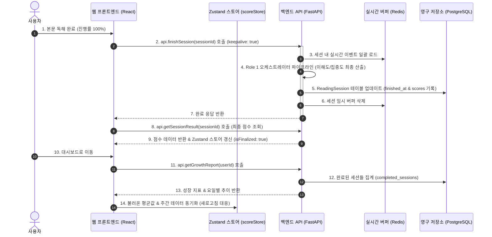

# AI 리터러시 코칭 대시보드 연동 & 동기화 개발 가이드

이 문서는 대시보드(Dashboard)와 백엔드(FastAPI) 간의 실시간 점수 연동 및 데이터 동기화 메커니즘, 기존에 발생했던 레이스 컨디션(Race Condition)과 렌더링 오류의 분석 및 해결 방법, 그리고 향후 유지보수를 위한 가이드를 담고 있습니다.

---

## 1. 시스템 아키텍처 & 데이터 흐름



### 핵심 데이터 모델 (PostgreSQL)
* **`ReadingSession`**: 사용자의 개별 읽기 세션 정보 (시작 시각, 종료 시각, 최종 리터러시 점수, 이해도 점수, 집중도 점수, 획득 XP 등).
* **`QuizResult`**: 세션 내에서 사용자가 푼 퀴즈 개별 정보 및 채점 결과 (`is_correct`).
* **`ReadingEvent`**: 세션 도중 발생한 실시간 스크롤/체류/룩업 행동 데이터.

---

## 2. 기존 발생 이슈 및 해결 내역 (개발 히스토리)

### 2.1. 대시보드 바로 이동 시 점수 롤백 현상 (Race Condition)
* **현상**: 완독 화면에서 대시보드로 즉시 이동하면, 리포트 점수가 실제 획득 점수가 아닌 기본값(`50`)으로 잠시 보였다가 시간이 흐른 뒤 복구되는 현상.
* **원인**: 사용자가 대시보드 이동 버튼을 누르는 순간, 백엔드에서 세션 완료 트랜잭션(`/finish`)이 아직 처리 중(커밋 전)이었습니다. 이 상태에서 대시보드가 `/growth` API를 즉시 호출하여 DB를 조회했기 때문에 아직 커밋되지 않은 새 세션 점수가 누락되어 발생한 타이밍 이슈였습니다.
* **해결**:
  1. **저장 상태 가드 도입**: Zustand 스토어에 `isFinalizing` 상태 플래그를 추가했습니다.
  2. **프론트엔드 버튼 비활성화**: 완독 카드(`SessionSummaryCard.tsx`)에서 `/finish` 요청이 끝날 때까지 대시보드 이동 버튼을 비활성화하고 `⚙️ 결과 분석 및 저장 중...` 상태로 유지하도록 조치했습니다.
  3. **대시보드 강제 대기**: 사용자가 강제로 대시보드로 진입하더라도 `isFinalizing`이 `true`인 동안에는 `/growth` 호출을 지연시키고 로딩 스피너를 보여주도록 `DetailedGrowthReport.tsx`를 수정했습니다.

### 2.2. 새로고침(F5) 시 점수가 50점(또는 0점)으로 희석되는 현상
* **현상**: 대시보드 페이지에서 F5 새로고침을 하거나 재시작하면 점수가 이전으로 롤백되는 문제.
* **원인 1 (백엔드)**: DB에 완독하지 않은 활성 세션(사용자가 읽다가 이탈하여 점수가 `None`인 상태)이 쌓여있는 경우, `/growth` API가 완료 여부와 관계없이 **모든 세션의 점수를 평균 계산**(`sum(scores) / len(sessions)`)해 반환했습니다. 이에 따라 계산되지 않은 `None` 값들이 50점(기본값)으로 환산되어 기존 완성된 실측 점수를 아래로 깎아내렸습니다.
* **원인 2 (프론트엔드)**: F5 새로고침 시 Zustand 전역 메모리 스토어가 초기화되면서 대시보드 UI 카드들이 바라보는 실시간 상태값들이 `0`으로 날아갔으나, 대시보드 마운트 시 호출되는 `/growth` 데이터의 평균 실측값들을 전역 스토어에 역으로 동기화해주지 않아 화면에 기본값만 표기되었습니다.
* **해결**:
  1. **백엔드 완료 세션 필터링 (`users.py`)**:
     성장 지표 분석 시 **완독 완료된 세션(`finished_at is not None`)들만 골라내어 지표를 산출**하도록 수정했습니다.
     ```python
     completed_sessions = [s for s in sorted_sessions if s.finished_at is not None]
     ```
  2. **프론트엔드 Zustand 동기화 (`DashboardPage.tsx`)**:
     대시보드 진입 및 새로고침 시, 백엔드로부터 응답받은 실측 누적 평균 점수를 Zustand 스토어의 `literacyScore`, `comprehensionScore`, `engagementScore`, `xp`, `level`에 다시 주입(setState)해주어 리프레시 후에도 데이터 일관성을 유지하도록 만들었습니다.

### 2.3. React Router 에러: Minified React error #310
* **현상**: 대시보드 렌더링 도중 `Error: Minified React error #310`이 발생하며 화면이 뻗어버리는 문제.
* **원인**: `LiteracyScoreChart.tsx`에서 데이터가 없을 때 렌더링을 일찍 끝내는 **조기 리턴(Early Return)** 구문 `if (!hasData)` **아래쪽에** `maxGap = useMemo(...)` 훅이 선언되어 있었습니다. React 훅 규칙에 따라 렌더링 간 훅의 실행 순서와 개수가 달라져 발생한 오류였습니다.
* **해결**: 모든 `useMemo`, `useCallback` 등의 React Hooks를 컴포넌트 최상단(조기 리턴 조건문보다 위)으로 이동시켜 무조건 동일한 순서로 호출되도록 순서를 바로잡았습니다.

### 2.4. 주간 비교 그래프가 빈칸으로 나오는 현상
* **현상**: 차트의 레이아웃은 그려지나 데이터 선이 그려지지 않고 헤더에 `• 점`으로 출력되는 문제.
* **원인**: Recharts 차트 컴포넌트의 `<Line dataKey="..." />` 매핑 키가 `before`/`after`로 하드코딩되어 있던 반면, 백엔드와 스토어에서 포맷팅해 주는 데이터 키는 `lastWeek`/`thisWeek`로 어긋나 있었습니다. 또한 최신 점수를 가져오는 로직이 무조건 일요일 인덱스를 읽도록 코딩되어 있어 주중에 접속할 경우 `null` 값을 읽어 깨졌던 것입니다.
* **해결**:
  1. `dataKey`를 스토어 데이터 포맷에 맞게 `lastWeek` 및 `thisWeek`로 통일했습니다.
  2. 최신 점수를 계산할 때 요일 배열을 역순으로 탐색하여 **가장 최근에 기록된 유효한 점수**를 가져오도록 `currentScore` 로직을 보완했습니다.
     ```typescript
     const latestWeeklyPoint = [...weeklyScoreSeries].reverse().find(d => d.thisWeek !== null && d.thisWeek !== undefined);
     ```

---

## 3. 향후 작업 시 주의사항 (체크리스트)

새로운 기능을 추가하거나 동기화 로직을 수정할 때 동료 개발자는 다음 사항을 반드시 검토해야 합니다.

1. **React Hooks 작성 규칙**:
   * 컴포넌트 내에서 조건문(`if`), 반복문, 혹은 특정 분기 리턴문 **이전**에 모든 `useState`, `useEffect`, `useMemo` 등의 훅 선언을 완료해야 합니다.
2. **세션 완료 상태 트랜잭션 순서**:
   * 완독(`/finish`) 요청이 먼저 진행되고 데이터 커밋이 완수된 후에 대시보드로 진입할 수 있도록 프론트엔드의 `isFinalizing` 가드 상태를 건드리지 않아야 합니다.
3. **로컬 테스트 vs 배포 빌드**:
   * Git에 푸시를 보낸 후 Vercel이나 Render가 빌드(Deploy)를 완전히 끝마쳤는지 모니터링해야 합니다. 
   * 배포 버전 반영 후 이전 청크 파일명이 남아 오류를 유발할 수 있으므로, 테스트 시 반드시 **`Ctrl + F5` 강력 새로고침**이나 **크롬 시크릿 창**을 이용해 캐시를 털고 검증해야 합니다.
